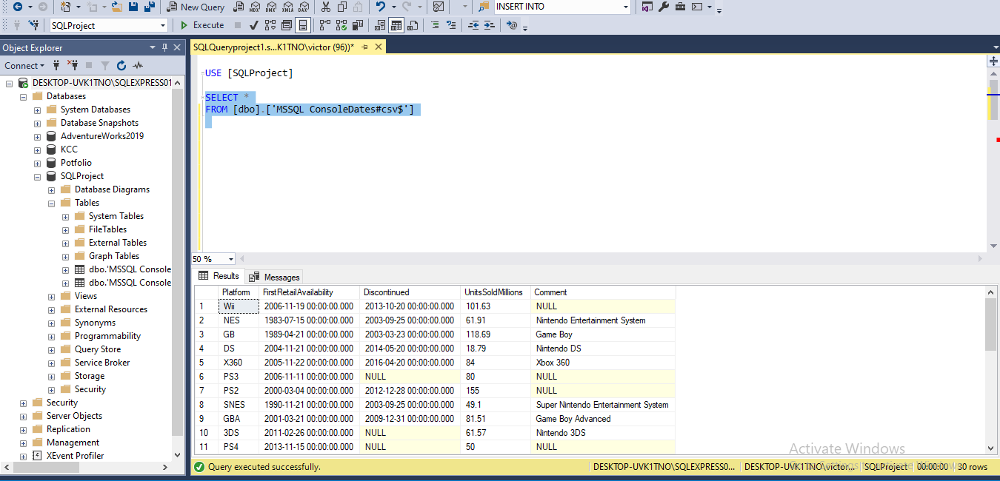
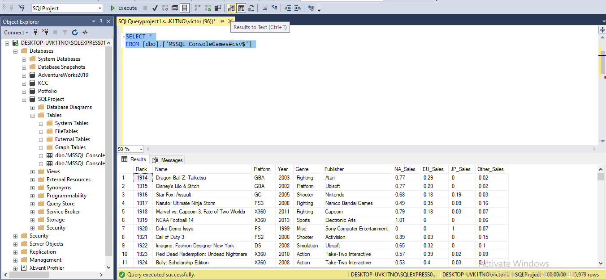
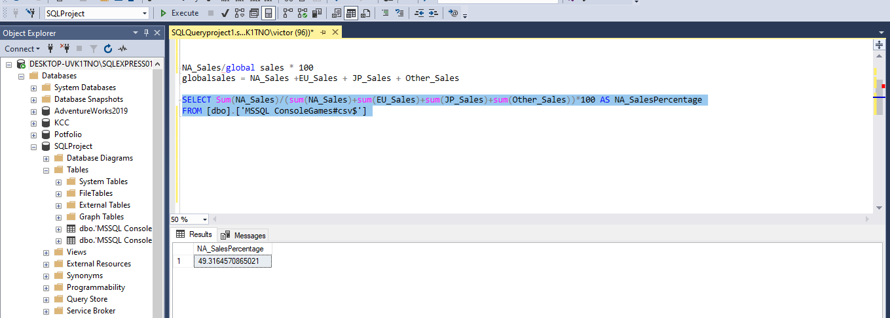
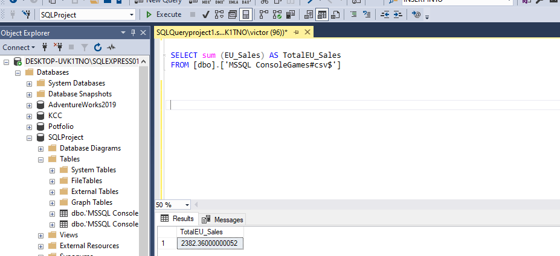
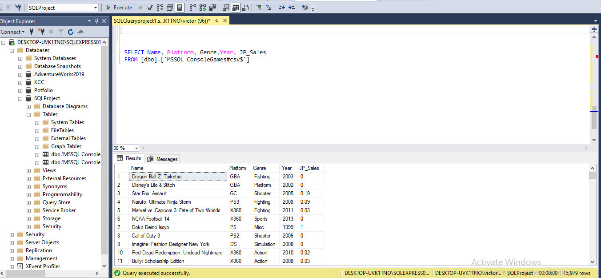
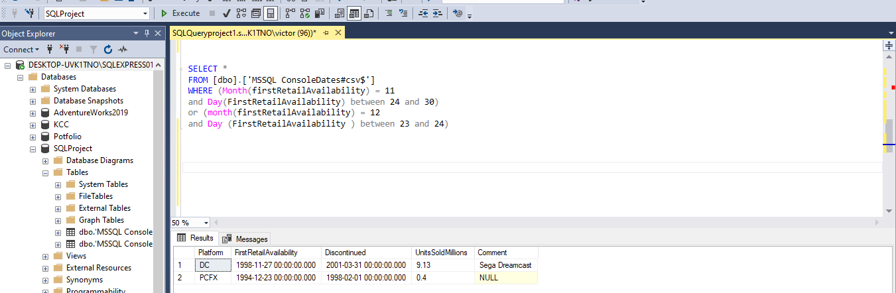

# Global_Sales_Analysis

## INTRODUCTION

This is an analysis of the Global sales of ConsoleGames and ConsoleDates. It is done by analyzing data from the MSSQL ConsoleGames and MSSQL ConsoleDates Table. I used SQL to query the data from the data base.

**Disclaimer**; This is not a real company data but the data was gotten from online for the purpose of this project.

**Problem Statement**.

The goal of this analysis is to

•	Know the sum of global sales

•	Know the percentage of global sales made in North America

•	Know and have a view of the year in which console platform were release

•	To know the first 4 letters of the publisher’s name

•	To know the console platform that were release either before black Friday or before Christmas of any year. 

•	Know unit sold in millions by platform

•	To know the sum of NA_sales and JP_Sales

•	Know the global_sales by platform and year

•	Finally, the goal is to create data driven and insight that can help in increasing sales by platforms that is in demand.

**Skills and concepts demonstrated**;

•	SQL (Select, sum, where, OR, Order by, View)

**Data Source**;

The data used for this work is gotten from online data source. I studied the data schema and found the right tables for the analysis. 
Data transformation 

•	Several structure queries were written to get the right values needed,platform and year of release and then save as views in the Database on SQL Management studio. The views are;
Console Games table

The queries I wrote on SQL are compile and uploaded in this repository.

View of the ConsoleDate 

View of the ConsoleGame

percentage of NA_Sale

Sum of EU_Sales

JP_Sales by year

Release date before black friday

